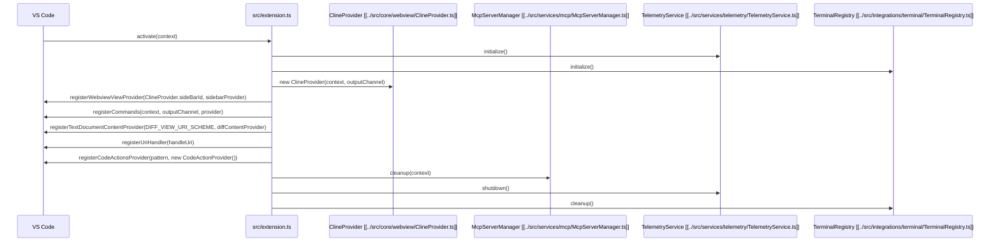

# Project Overview

This project is a VS Code extension named "Roo Code" that provides AI-powered code assistance. It leverages large language models (LLMs) to provide features such as code completion, code generation, code explanation, and more.

## Key Areas

*   **Core:** Contains the core logic of the extension, including the [`Cline`](../src/core/Cline.ts) class, code action provider, and webview management. The `core` directory is responsible for managing the extension's state, interacting with VS Code, and orchestrating the communication between different components.
*   **API:** Defines the API for interacting with different language models (LLMs) and providers. The `api` directory provides a consistent interface for accessing various LLMs, such as OpenAI, Anthropic, and others.
*   **Webview UI:** Implements the user interface using React, TypeScript, and Tailwind CSS. The `webview-ui` directory contains the code for the webview, which is used to display the user interface to the user.
*   **Integrations:** Integrates the extension with various VS Code features, such as diagnostics, editor actions, and terminal actions. The `integrations` directory contains the code for integrating the extension with VS Code's features.
*   **Services:** Provides various services, such as browser integration, MCP integration, and telemetry. The `services` directory contains the code for providing various services to the extension.

## Top-Level Files

*   [`src/extension.ts`](../src/extension.ts): The main entry point for the extension. This file is responsible for activating and deactivating the extension, registering commands, and initializing the various components.
*   [`webview-ui/src/App.tsx`](../webview-ui/src/App.tsx): The main component for the webview UI. This file defines the structure and layout of the UI.
*   [`package.json`](../package.json): Contains the extension's metadata, dependencies, and build scripts. This file is used by VS Code to install and manage the extension.

## External Dependencies

*   **Model Context Protocol (MCP):** Used for integrating with external tools and services. MCP allows the extension to communicate with other applications and services, such as code linters and formatters.
*   **Language Models (LLMs):** Supports various LLMs through the API providers. The extension supports a variety of LLMs, allowing users to choose the model that best suits their needs.

## Program Flow

### Plugin Initialization



### User Chat Loop

```mermaid
sequenceDiagram
    participant User as User
    participant VSCode as VS Code
    participant ClineProvider as ClineProvider [[../src/core/webview/ClineProvider.ts]]
    participant Cline as Cline [[../src/core/Cline.ts]]
    participant APIProvider as APIProvider [[../src/api/providers/base-provider.ts]]
    participant LLM as LLM
    participant ToolManager as ToolManager

    User->>VSCode: Enters message in Cline
    VSCode->>ClineProvider: postMessageToWebview({type: "userMessage", text: message})
    ClineProvider->>Cline: Handles user message
    Cline->>ToolManager: Determines if tool is needed
    alt Tool is needed
        ToolManager->>APIProvider: Sends request to tool
        APIProvider->>LLM: Sends request to LLM to use tool
        LLM-->>APIProvider: Returns tool result
        APIProvider->>Cline: Transforms tool result
        Cline->>ClineProvider: postMessageToWebview({type: "toolResult", text: toolResult})
        ClineProvider->>VSCode: Displays tool result in Cline
        VSCode->>User: Displays tool result
    else Tool is not needed
        Cline->>APIProvider: Sends message to API Provider
        APIProvider->>LLM: Sends request to LLM
        LLM-->>APIProvider: Returns response
        APIProvider->>Cline: Transforms response
        Cline->>ClineProvider: postMessageToWebview({type: "assistantMessage", text: response})
        ClineProvider->>VSCode: Displays message in Cline
        VSCode->>User: Displays message
    end
